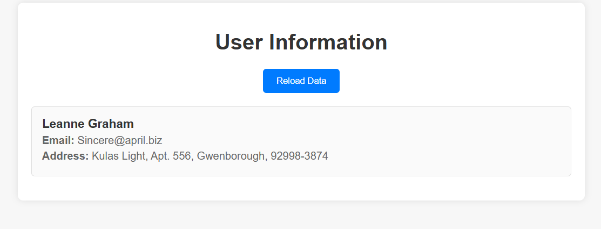
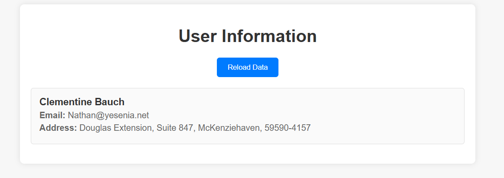
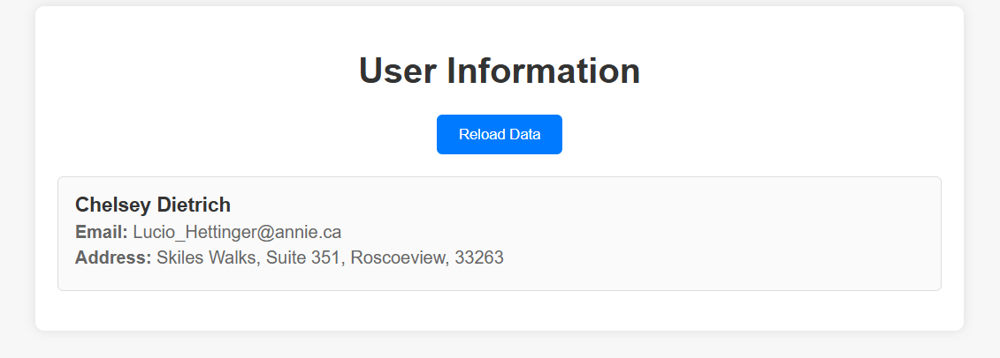

# Task 7: Fetch and Display User Data using Fetch API

This project was built as part of a Web Development Internship task. The objective was to use JavaScript's Fetch API to retrieve and display user data from a public API — showing one user's details at a time and navigating through them using a "Reload Data" button.

---

## 📌 Objective

- Use the Fetch API to retrieve JSON data from a public endpoint.
- Display user name, email, and full address in a styled card.
- Show only one user at a time.
- Add a button to cycle through users one by one.
- Handle errors like network failure.

---

## 🧠 Concepts Used

- JavaScript Fetch API
- Async/Await
- JSON Parsing
- DOM Manipulation
- Error Handling
- Event Handling
- Responsive CSS

---

## 🔧 Technologies

- HTML5
- CSS3
- JavaScript (ES6)

---

## 📂 Project Structure

```
📁 ElevateLabsDay7/
├── index.html 
├── styles.css 
├── script.js 
└── README.md
```

---

## 🚀 How to Run

1. Clone this repository:
   ```bash
   git clone https://github.com/Akash-088/Fetch-API.git
   ```
2. Open index.html in any browser
3. View user info and click Reload Data to navigate through

---

🧪 Test Scenarios

✅ Initial user loads on page load
✅ Clicking "Reload Data" cycles through the list
✅ After last user, returns to first
✅ Network error is handled with a friendly message

---

🛠 Technologies Used

HTML5
CSS3
JavaScript (ES6+)

---

📸 Screenshot





